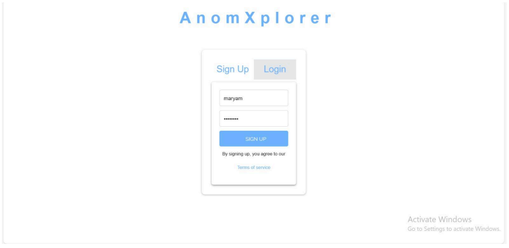
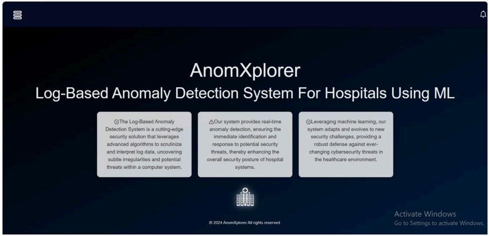
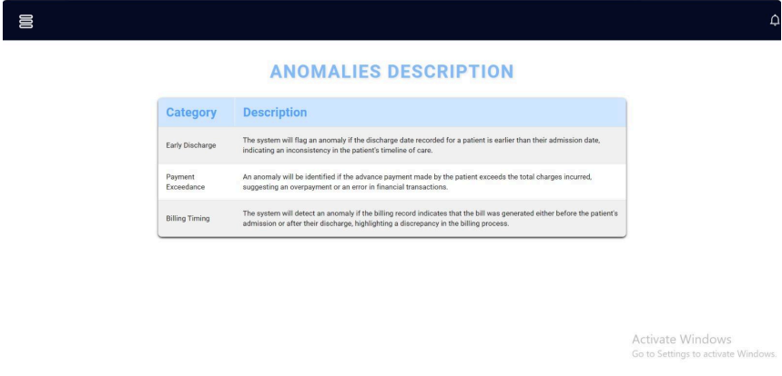
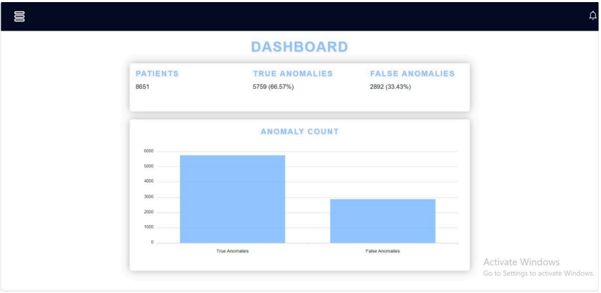
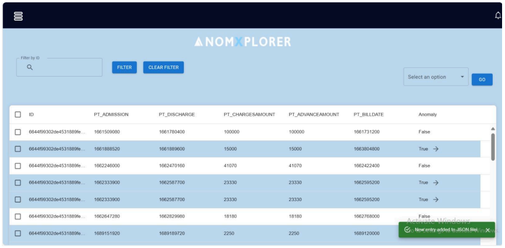
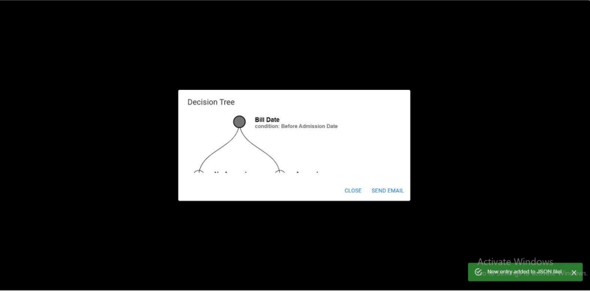
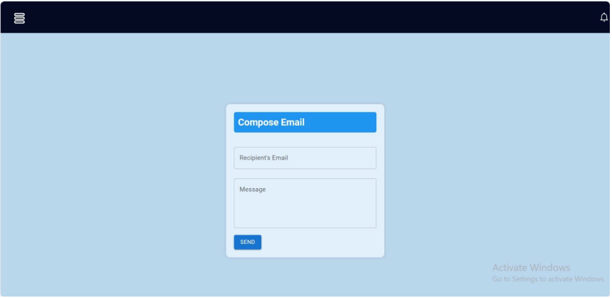

# Project Title
**AnomXplorer- Anomaly Detector System for HealthCare System**

Log Based Testing Through Machine Learning for Hospital Management Systems

## Section Title
**Description To Project**

Our project explores machine learning for log-based testing in hospital systems to enhance data integrity and security by detecting
anomalies in system logs. We propose an advanced anomaly detection system using a decision tree algorithm for real-time analysis
applied in a Jupyter Notebook for real-time analysis. The system includes a React.js frontend, Node.js backend (Express), and
MongoDB, offering administrators an intuitive interface for managing hospital data. Preprocessing ensures data readiness, with
dynamic anomaly displays and a dashboard showing frequency and patient statistics. Expected outcomes include improved data
monitoring and security in hospitals.

## Table of Contents
- [Features](#features)
- [Project Objectives](#project-objectives)
- [What problem it addresses](#what-problem-it-addresses)
- [Screenshots](#screenshots)
- [API Reference](#api-reference)
- [Installation](#installation)
  - [Prerequisites](#prerequisites)
  - [Backend Setup](#backend-setup)
  - [Frontend Setup](#frontend-setup)
- [Contributing](#contributing)
- [Acknowledgments](#acknowledgments)


## Features
The project includes:

- User authentication and authorization
- Real-time anomaly detection
- Data Visualization/Analysis
- Notification System for critical anomalies

## Project Objectives
The objectives include:
- Enhancing security.
- Improving anomaly detection accuracy by using ML algorithm.
- Providing real-time data visualization.

## What problem it addresses
The need for an anomaly detection system tailored for hospital systems
stems from several critical factors:

- *Manual Testing*: Hospitals are testing their system manually or
automated but still require resources and a lot of time so our project
aims to detect anomalies using machine learning algorithms to be
more effective and fast.
- *Patient Safety and Care Quality*: Anomalies within hospital systems
have potential to threaten patient safety and care quality. Detecting
and addressing these anomalies in a timely manner is paramount to
ensuring optimal patient outcomes.
- *Operational Efficiency*: By identifying and addressing these
anomalies, hospitals can streamline operations and optimize resource
allocation.

## What problem it addresses
The proposed AnomXplorer offers several benefits to healthcare
organizations and stakeholders:

- Prevention of Extra charges and Unauthorized fees: Hospital bills
often include various charges and fees for services. However,
anomalies such as unauthorized fees or excessive charges can result
in financial burdens for patients and undermine trust in healthcare
institutions.
- Early Anomaly Detection: By leveraging ML algorithms, the system
can detect anomalies in hospital systems data in real-time, enabling
early intervention of potential risks.
- Data-driven insights: By providing actionable insights into the
performance and integrity of hospital systems, the healthcare
administrators can make informed decisions and implement targeted
interventions to improve system reliability and performance

## Screenshots
Here are some screenshots of the frontend of our project:

### Login Page


### Home Page


### Anomaly Description


### Dashboard


### Logs


### Graph Visualization


### Sending Alert


## API Reference

| Endpoint          | Method | Description                                        |
| ----------------- | ------ | -------------------------------------------------- |
| `/api/users`      | GET    | Get all users from the database                    |
| `/api/signup`     | POST   | Register a new user by saving user info in the DB  |
| `/api/login`      | POST   | Log in an existing user by validating credentials  |
| `/api/predictions`| GET    | Get all predictions from the database              |
| `/api/Email`      | POST   | Send an email for anomaly detection with a message |


### Sample Request for `/api/signup`

To register a new user, you can use the following sample request:

**Method**: `POST`  
**URL**: `http://localhost:5000/api/signup`

**Headers**:
- `Content-Type: application/json`
**Body**:
```json
{
  "username": "newUser",
  "password": "securePassword123"
}
```

**Curl Command**

curl -X POST http://localhost:5000/api/signup 
-H "Content-Type: application/json" \
-d '{"username": "newUser", "password": "securePassword123"}'

## Installation
Follow these steps to set up and run the project locally:

### Prerequisites

- Node.js (version 14 or higher)
- npm (Node Package Manager)
- MongoDB (Make sure you have a running instance)

### Backend Setup

1. **Clone the repository:**
   ```bash
   git clone 
   cd your-repo-name/server https://github.com/MaryamRaheemKhan/AnomXplorer.git

2. **Install Dependencies:**
   npm install

3. **Configure Environmental Variables**
- Create a .env file in the root of the server directory and add your MongoDB connection string and any  other necessary environment variables.

4. **Run the server:**
- For development:
  npm run dev
- For production:
  npm start

5. **Access the server:**
- The server will be running at http://localhost:5000.

### Frontend Setup

1. **Navigate to the client directory:**
   cd ../client

2. **Install dependencies:**
   npm install

3. **Run the client:**
   npm start

4. **Access the client:**
- The client will be running at http://localhost:3000. 

**Notes**
- Ensure that your MongoDB instance is running before starting the server.
- If you're using a different port for the frontend or backend, make sure to update your configurations accordingly.

### Explanation of the Structure:
1. **Prerequisites**: Lists the required software and versions needed for setup.
2. **Backend Setup**: 
   - Steps for cloning the repository, installing dependencies, configuring environment variables, and running the server.
3. **Frontend Setup**: 
   - Instructions for navigating to the frontend directory, installing dependencies, and running the client.
4. **Notes**: Any additional information that may be helpful for users to know.

Feel free to replace `https://github.com/yourusername/your-repo-name.git` with the actual URL of your repository. This structure will help users set up your project easily! If you have any more sections or details to add, let me know!


### **Contributing**
Let others know how they can contribute to the project. It’s helpful to include guidelines, link to any `CONTRIBUTING.md` file, and specify any coding standards (linting, formatting, etc.).

```md
## Contributing

Contributions are what make the open-source community such a great place to learn, inspire, and create. Any contributions you make are **greatly appreciated**.

1. Fork the Project
2. Create your Feature Branch (`git checkout -b feature/AmazingFeature`)
3. Commit your Changes (`git commit -m 'Add some AmazingFeature'`)
4. Push to the Branch (`git push origin feature/AmazingFeature`)
5. Open a Pull Request

```

## Acknowledgements
- [React](https://reactjs.org/)
- [Material UI](https://mui.com/)
- [Socket.io](https://socket.io/)